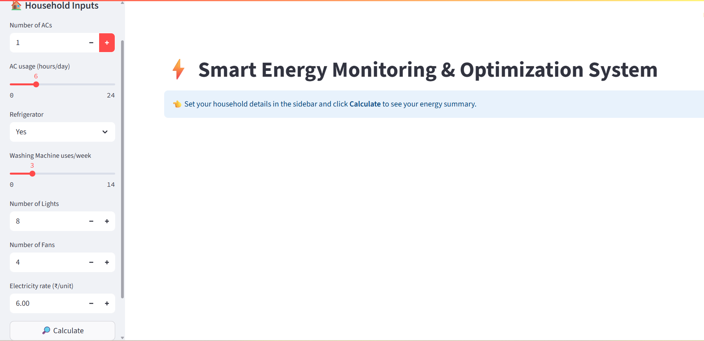
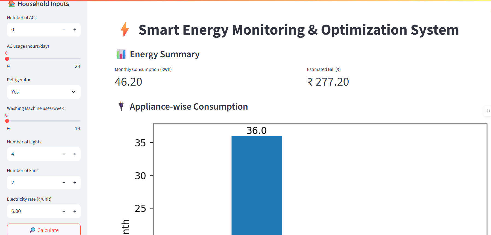
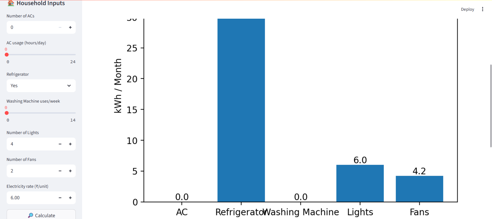
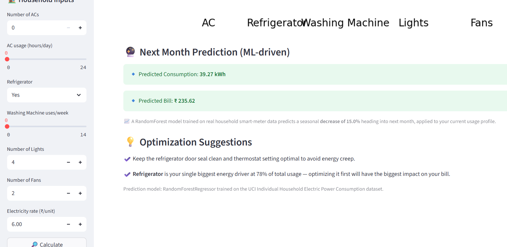

# ⚡ AI-Driven Smart Energy Monitoring & Optimization System

An AI-powered Smart Energy Monitoring and Optimization System that helps households estimate monthly electricity consumption, predict future energy usage using Machine Learning, calculate electricity bills, visualize appliance-wise consumption, and receive personalized energy-saving recommendations.

---

## 📸 Application Preview

### 🏠 Home Page


### 📊 Energy Summary


### 📈 Appliance-wise Energy Consumption


### 🤖 ML Prediction & Optimization Suggestions


---

# 🚀 Quick Start

## Step 1 — Clone the Repository

```bash
git clone https://github.com/Harini-Nagireddy/AI-Driven-Smart-Energy-Monitoring-and-Optimization-System.git
```

---

## Step 2 — Install Dependencies

```bash
python -m pip install -r requirements.txt
```

---

## Step 3 — Run the Application

```bash
cd app
streamlit run app.py
```

---

## Step 4 — Open in Browser

```
http://localhost:8501
```

---

# 🎯 Project Overview

The system allows users to enter household appliance details such as:

- Number of Air Conditioners
- Daily AC Usage
- Refrigerator Availability
- Washing Machine Usage
- Number of Lights
- Number of Fans
- Electricity Rate

Based on these inputs, the application calculates total monthly electricity consumption and provides intelligent insights for reducing energy costs.

---

# ✨ Key Features

- ✅ Interactive Streamlit Dashboard
- ✅ Monthly Electricity Consumption Estimation
- ✅ Electricity Bill Calculation
- ✅ Appliance-wise Energy Consumption Analysis
- ✅ Machine Learning-Based Next Month Prediction
- ✅ Estimated Future Electricity Bill
- ✅ Intelligent Energy Optimization Suggestions
- ✅ Interactive Charts & Visualizations
- ✅ Easy-to-use Household Input Interface
- ✅ Real-time Energy Summary

---

# 📊 Dashboard Outputs

The application generates:

- Monthly Energy Consumption (kWh)
- Estimated Electricity Bill
- Appliance-wise Consumption Chart
- Predicted Next Month Consumption
- Predicted Next Month Electricity Bill
- Personalized Energy Saving Recommendations

---

# 🤖 Machine Learning

The prediction module uses a **Random Forest Regressor** trained on household electricity consumption data to forecast next month's energy usage and estimated electricity bill.

The model analyzes user input and predicts future consumption trends while generating optimization recommendations.

---

# 🛠 Tech Stack

## Programming Language

- Python

## Frontend

- Streamlit

## Machine Learning

- Scikit-learn
- Random Forest Regressor

## Data Processing

- Pandas
- NumPy

## Data Visualization

- Matplotlib

---

# 📂 Project Structure

```
AI_Driven_Smart_Energy_Monitoring_and_Optimization_System/
│
├── app/
│   ├── app.py
│   └── energy_calculator.py
│
├── src/
│   ├── prediction.py
│   ├── preprocess.py
│   ├── train_model.py
│   ├── feature_engineering.py
│   ├── behavioral_insights.py
│   ├── appliance_insights.py
│   ├── bill_estimation.py
│   ├── cost_estimation.py
│   └── time_insights.py
│
├── data/
├── notebooks/
├── reports/
├── screenshots/
├── requirements.txt
├── .gitignore
└── README.md
```

---

# 📌 Workflow

1. Enter household appliance details.
2. Click **Calculate**.
3. View monthly energy consumption.
4. Check estimated electricity bill.
5. Analyze appliance-wise energy usage.
6. View machine learning prediction for next month.
7. Read personalized optimization recommendations.

---

# 📈 Sample Outputs

- Monthly Consumption (kWh)
- Estimated Electricity Bill
- Appliance-wise Energy Chart
- Predicted Monthly Consumption
- Predicted Electricity Bill
- Energy Saving Suggestions

---

# 💡 Optimization Suggestions

The application provides recommendations such as:

- Reduce excessive appliance usage.
- Optimize Air Conditioner operating hours.
- Improve refrigerator efficiency.
- Switch to LED lighting.
- Schedule high-energy appliances efficiently.
- Monitor household energy consumption regularly.

---

# 🔧 Troubleshooting

### Streamlit Not Found

Run:

```bash
python -m streamlit run app.py
```

---

### Missing Packages

Run:

```bash
python -m pip install -r requirements.txt
```

---

### Browser Doesn't Open Automatically

Open manually:

```
http://localhost:8501
```

---

# 🚀 Future Enhancements

- Smart Meter Integration
- IoT Sensor Support
- Weather-Based Energy Prediction
- Solar Energy Recommendation
- Carbon Footprint Estimation
- Energy Usage History Dashboard
- Mobile Application Support

---

# 👩‍💻 Author

**Harini Nagireddy**

B.Tech – Computer Science & Engineering (Data Science)

Passionate about Machine Learning, Artificial Intelligence, Data Science, and Software Development.

---

# 📜 License

This project was developed as an academic and portfolio project for educational and demonstration purposes.